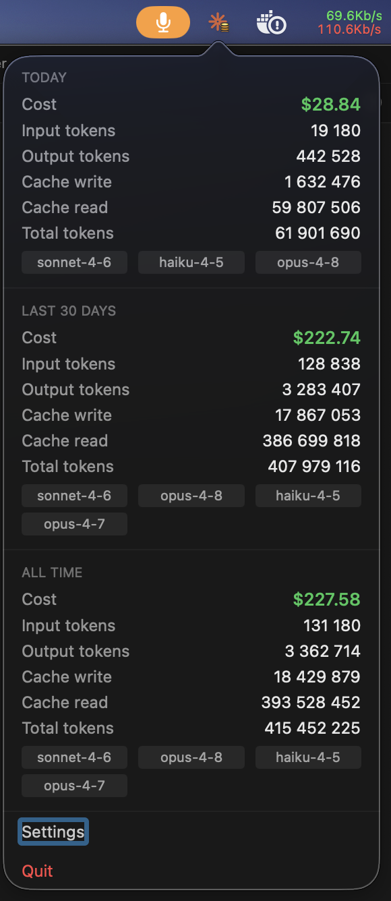
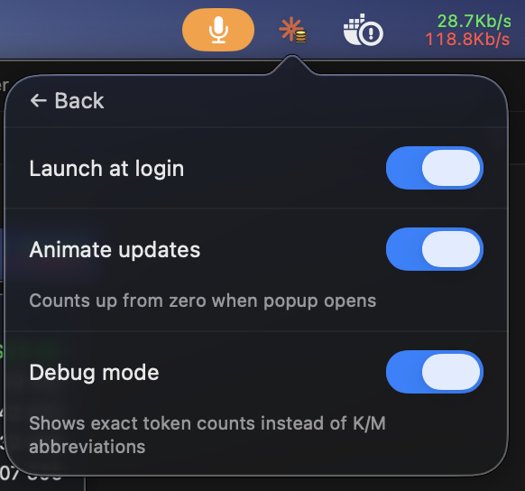

# Claude Usage Tracker Bar

<p align="center">
  
</p>

A lightweight native macOS menu bar app that shows your [Claude Code](https://claude.ai/code) token usage in real time — cost, token breakdown, and models used — directly from local logs. No API calls, no accounts, no telemetry.

## Features

- **Real-time updates** — watches `~/.claude/projects/**/*.jsonl` via FSEvents; animates on change
- **Three time windows** — Today, Last 30 Days, All Time
- **Full token breakdown** — Input, Output, Cache Write, Cache Read, Total
- **Models used** — displayed as compact tags per section
- **Cost estimate** — calculated locally from Anthropic's published pricing
- **Colored menu bar icon** — orange spark + gold coin stack, visible on any menu bar
- **Launch at login** — enabled by default via SMAppService
- **Debug mode** — shows exact token counts with thousands separators instead of K/M
- **Animate updates** — numbers transition smoothly when new tokens arrive

## Screenshots

<p align="center">
  
  &nbsp;&nbsp;
  
</p>

## Install

### Option A — Download DMG (recommended)

1. Download `ClaudeUsageTrackerBar.dmg` from [Releases](https://github.com/yettimon/claude-usage-tracker-bar/releases)
2. Open the DMG and drag the app to `/Applications`
3. **First launch:** right-click → Open (required once to bypass Gatekeeper — app is unsigned)
   > If macOS says "damaged and can't be opened", run: `xattr -cr /Applications/ClaudeUsageTrackerBar.app`

### Option B — Build from source

**Requirements:** macOS 13+, Xcode 15+, [xcodegen](https://github.com/yonaskolb/XcodeGen)

```bash
git clone https://github.com/yettimon/claude-usage-tracker-bar.git
cd claude-usage-tracker-bar
./xcodegen.sh                          # generate .xcodeproj
open ClaudeUsageTrackerBar.xcodeproj  # then ⌘R in Xcode
```

## How it works

Claude Code writes every API response to JSONL files under `~/.claude/projects/`. This app:

1. Enumerates all `*.jsonl` files recursively (including `subagents/` directories)
2. Parses `assistant`-type entries, skipping synthetic/internal entries
3. Deduplicates by `requestId`, keeping the entry with the highest total token count (streaming writes partial entries first)
4. Aggregates into Today / Last 30 Days / All Time buckets
5. Calculates cost using a local pricing table based on [Anthropic's published rates](https://www.anthropic.com/pricing)

Costs are estimates. Cache write rates use the 5-minute TTL tier.

## Built with

| Tool | Purpose |
|---|---|
| [Swift](https://www.swift.org) + SwiftUI + AppKit | Native macOS UI — ~10 MB idle RAM vs ~80 MB for Electron alternatives |
| [FSEvents](https://developer.apple.com/documentation/coreservices/file_system_events) (CoreServices) | Low-level filesystem watching — fires within 500 ms of any JSONL write |
| [SMAppService](https://developer.apple.com/documentation/servicemanagement/smappservice) (ServiceManagement) | macOS 13+ API for launch-at-login without a helper bundle |
| [XcodeGen](https://github.com/yonaskolb/XcodeGen) | Generates `ClaudeUsageTrackerBar.xcodeproj` from `project.yml` — no checked-in pbxproj noise |
| [GitHub Actions](https://github.com/features/actions) | Unsigned DMG built and released automatically on every `v*` tag push |
| [ccusage](https://github.com/ryoppippi/ccusage) | Primary inspiration — referenced its Rust source for JSONL entry structure, `requestId` deduplication strategy, sidechain filtering, and subagent path discovery |
| [Claude Code](https://claude.ai/code) | Entire codebase written via AI-assisted development with Claude Sonnet |

## Roadmap

- [ ] Multiple Claude accounts / data directories
- [ ] Usage alerts and spending limits
- [ ] Charts and historical graphs
- [ ] Windows / Linux support

## Contributing

Feature ideas, bug reports, and pull requests are welcome. If you'd like to work on any roadmap item — or have an idea not listed — please [open an issue](https://github.com/yettimon/claude-usage-tracker-bar/issues) to discuss it first. PRs without a linked issue may be closed without review.

To build locally see the **Build from source** section above.

## Disclaimer

This is an unofficial tool and is not affiliated with or endorsed by Anthropic. The menu bar icon is derived from Anthropic's Claude brand assets and is used for identification purposes only.

Cost estimates may differ from actual Anthropic billing. Token counts are read directly from local logs and may not account for all billing factors.

## License

[MIT](LICENSE)
